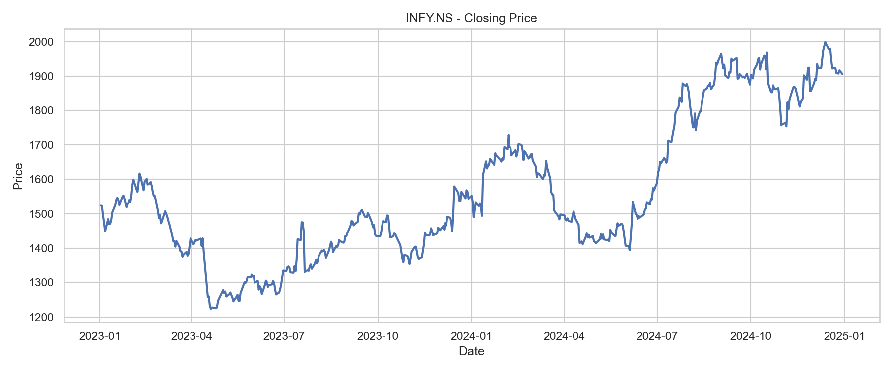
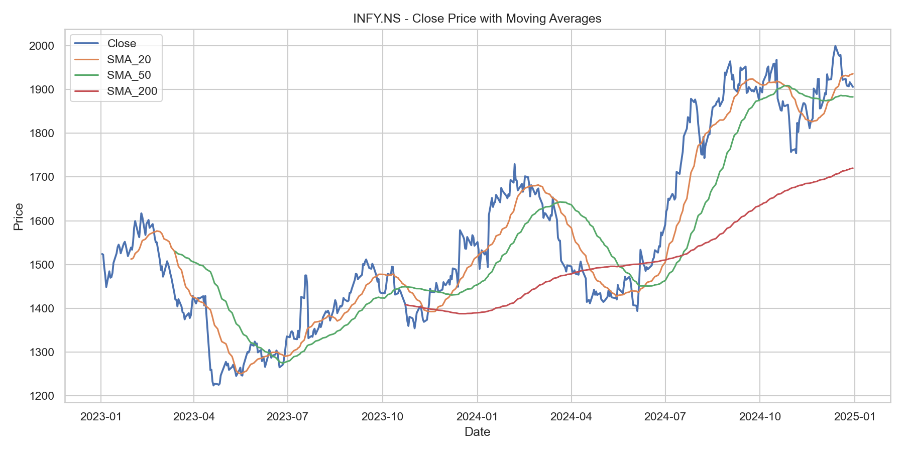
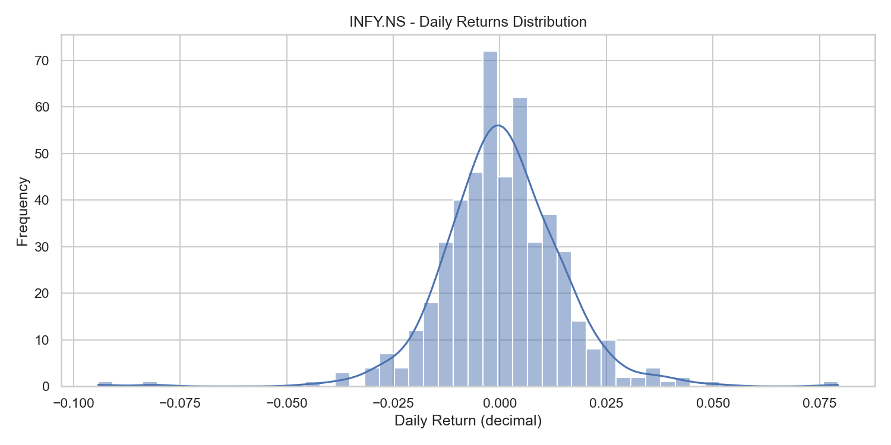
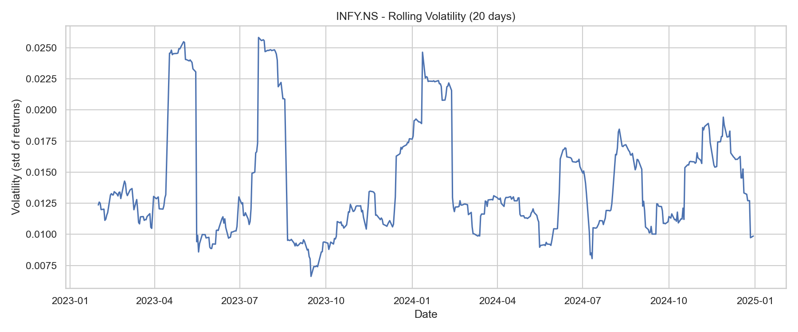

# Stock Market Data Analyzer

A Python project that fetches stock market data from Yahoo Finance (via `yfinance`), cleans and analyzes it, generates technical indicators, exports CSV outputs, saves visualizations, creates a Markdown report, and provides an interactive Streamlit dashboard.

This run/demo is done for **INFY.NS** for the period **2023-01-01 to 2024-12-31** (trading days only).

---

## Features
- Fetch stock OHLCV data using Yahoo Finance (`yfinance`)
- Clean and standardize dataset
- Add indicators:
  - Daily returns
  - Simple moving averages (SMA 20/50/200)
  - Rolling volatility (20D)
  - Drawdown
- Save outputs:
  - Cleaned CSV
  - Summary CSV
  - PNG charts
  - Markdown report with embedded plots
- Streamlit dashboard for interactive exploration

---

## Tech Stack
- Python
- pandas, numpy
- matplotlib, seaborn
- yfinance
- streamlit

---

## Project Structure
- `src/` – core modules (fetching, cleaning, analytics, reporting)
- `notebooks/` – Jupyter notebook for EDA
- `outputs/` – generated CSV files
- `images/` – saved plots (PNG)
- `reports/` – generated Markdown report
- `main.py` – CLI pipeline
- `app_streamlit.py` – Streamlit dashboard

---

## How to Run (CLI)

### 1) Install dependencies
```bash
pip install -r requirements.txt
```

### 2) Run analysis
```bash
python main.py --ticker INFY.NS --start 2023-01-01 --end 2024-12-31
```

### 3) Generated files (INFY.NS)
- Cleaned data: `outputs/INFY.NS_cleaned.csv`
- Summary: `outputs/INFY.NS_summary.csv`
- Report: `reports/report_INFY.NS_2023-01-02_to_2024-12-30.md`
- Charts:
  - `images/INFY.NS_close.png`
  - `images/INFY.NS_moving_averages.png`
  - `images/INFY.NS_returns_distribution.png`
  - `images/INFY.NS_volatility.png`

---

## Run Streamlit Dashboard
```bash
streamlit run app_streamlit.py
```

---

## Results (INFY.NS)

### Charts





### Report
See: `reports/report_INFY.NS_2023-01-02_to_2024-12-30.md`

---

## Author
Debarati  
